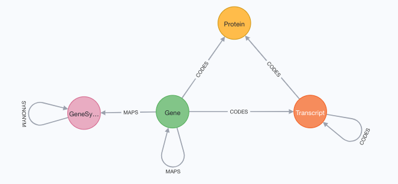

# real world example data for graphio-py2neo integration

## data
There are three data files:
- `Homo_sapiens.gene_info.gz`
- `Homo_sapiens.GRCh38.101.chr_patch_hapl_scaff.gtf.gz`
- `Homo_sapiens.GRCh38.101.entrez.tsv.gz`

In total this creates 617,066 nodes and 593,460 relationships.

## loading script
The `load_data.py` has three parser functions (one for each file) that create a couple of `NodeSets` 
and `RelationshipSets`. They all return a `Container` with the respective `NodeSets`/`RelationshipSets`.

The script first runs all three parser functiont. Then it iterates over all `NodeSets`, creates the indexes and loads the data. In the last
step it iterates over all `RelationshipSets`, creates indexes and loads data.

## helper
The `helper.py` module contains a function to parse a specific file format. This is used in the 
parser function `parse_ensembl`. 